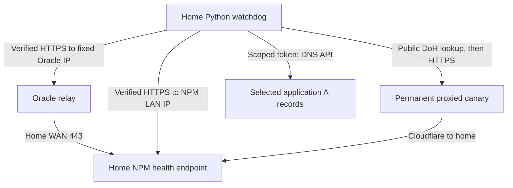
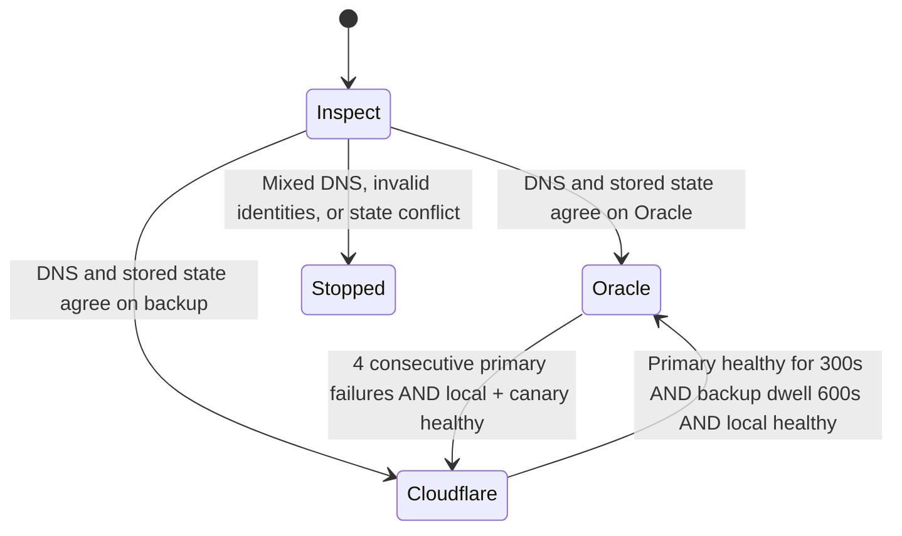

# Design

## Separate traffic forwarding from route selection

HAProxy on Oracle forwards TLS traffic. The watchdog at home decides which DNS route new clients should take. Oracle does not run the watchdog and cannot switch DNS by itself. Its normal systemd service starts HAProxy again after reboot.

## DNS ownership

The interactive wizard creates a **fixed home IP** configuration. It discovers record IDs by reading the chosen Cloudflare zone. It does not create records or mutate remote DNS.

| Record | Normal state | Backup state | Writer |
| --- | --- | --- | --- |
| `example.com` A | Oracle, DNS only, TTL 60 | Home, proxied, Auto | Watchdog |
| `*.example.com` A | Oracle, DNS only, TTL 60 | Home, proxied, Auto | Watchdog |
| `edge-health.example.com` A | Home, proxied, Auto | Same | Operator; read-only to fixed-IP watchdog |
| Explicit unrelated CNAME/A/Worker records | Existing configuration | Existing configuration | Existing owner |
| MX/TXT and other unrelated records | Existing configuration | Existing configuration | Existing owner |

An explicit DNS name can override wildcard behavior. The wizard defaults to apex plus wildcard, but `--app` selects other existing A records. The controller never rewrites every record in the zone indiscriminately. See [Cloudflare wildcard behavior](https://developers.cloudflare.com/dns/manage-dns-records/reference/wildcard-dns-records/).

For each managed name, it verifies the A record's exact ID/name and rejects a conflicting A, AAAA, CNAME, HTTPS, or SVCB record at that name. Optional exact comments can strengthen ownership checks. Unrelated records are read during inventory but not patched. Inspect explicit subdomains and Worker routes separately: checking the apex/wildcard does not audit every possible application route.

### Advanced origin-record mode

The controller also supports replacing `home_ip` with an `origin` reference to a dedicated DNS-only DDNS A record. That record remains owned by your DDNS updater. In that mode the watchdog can update the canary to the current DDNS address and then reconcile the application records.

The included Oracle HAProxy renderer still produces a fixed-IP backend. Enabling `origin` mode alone does **not** update Oracle's backend, arrange DDNS, or supply a complete dynamic-home-IP deployment. The installation guide intentionally uses fixed `home_ip`; do not configure both fields.

## Three independent HTTPS checks

| Check | Socket destination | TLS SNI and HTTP Host | Purpose |
| --- | --- | --- | --- |
| `primary` | Configured Oracle IPv4:443 | Health hostname | Verifies Oracle → home → NPM regardless of current app DNS |
| `local` | NPM LAN IPv4:443 | Health hostname | Verifies home NPM is available |
| `canary` | Public A answer for permanent proxied health hostname | Canary hostname | Verifies Cloudflare → home → NPM |

All require a valid certificate, status 200, the exact configured body including newline, and `Cache-Control: no-store`. Each request includes a random cache-busting query. The canary additionally requires `CF-Ray` and `CF-Cache-Status` of `DYNAMIC` or `BYPASS`.

The canary resolver opens TLS to public `1.1.1.1:443` with SNI `cloudflare-dns.com` and requests the hostname's A records through DNS-over-HTTPS. It validates the resolver certificate and accepts only public IPv4 answers for the exact name. A lookup failure fails the probe; it does not fall back to LAN DNS. This prevents a local wildcard override from making a direct LAN response look like a working Cloudflare route. [Cloudflare DoH JSON API](https://developers.cloudflare.com/1.1.1.1/encryption/dns-over-https/make-api-requests/dns-json/).

The chosen public destination changes with fresh DNS answers; it is not a hardcoded Cloudflare website IP. The original hostname is retained for TLS validation and HTTP routing. Outbound proxies from environment variables are not used for these checks or the DNS API.

Probe jobs run in child processes with a total deadline, including DNS/TLS/body reading. The default health budget is five seconds, with API calls separately bounded at ten seconds. If one child stalls, the parent stops it. System clocks must be accurate for TLS validation; health-duration accounting uses monotonic time.

## Switching state machine

With a 15-second interval, four failed samples usually require roughly a minute, plus API execution and resolver caching. This is not a hard recovery-time guarantee.

Only return to Oracle is gated by the minimum dwell; a newly failed Oracle route can fail over without waiting ten minutes. Continuous healthy time and dwell both restart when the watchdog starts. A gap longer than twice the sample interval resets continuous health. An API failure also resets the health window and holds/backoffs rather than inventing a successful write.

A healthy Cloudflare canary is required to move into fallback. It is not required to return to a healthy Oracle route. `--check` requires all three checks because it verifies readiness of the complete deployment. Manual `--once --mode … --apply` bypasses waiting periods but still requires valid record identities and a healthy local/selected destination.

## API writes and crash handling

1. Read and validate the current zone inventory.
2. Probe the routes and compute a desired mode.
3. Save desired mode and timestamp atomically before a potentially ambiguous DNS write.
4. Submit only required A-record PATCHes in a batch.
5. Read DNS records back from the API and verify content, proxy status, and TTL.

During a running process, lost responses or partial outcomes are reconciled against the persisted intent. On a fresh start, mixed records or stored-state disagreement require explicit operator recovery. The controller chooses caution over silently deciding that an unexpected DNS edit represents an outage.

One file lock prevents concurrent controllers sharing a state file. The state write uses a private temporary file, `fsync`, and atomic replacement. These mechanisms assume a suitable local filesystem; they do not coordinate multiple independent watchdog hosts or distinct state files.

Cloudflare API batching is not instantaneous worldwide DNS propagation. Clients may retain old answers, reuse existing connections, or take longer than the displayed TTL to move. [Cloudflare batch changes](https://developers.cloudflare.com/dns/manage-dns-records/how-to/batch-record-changes/), [TTL behavior](https://developers.cloudflare.com/dns/manage-dns-records/reference/ttl/).

## Relay limits

HAProxy routes only an ordinary TLS ClientHello with a matching apex/subdomain SNI to one fixed home TCP 443 backend. No HTTP parser, certificate, private key, or PROXY protocol is configured at Oracle.

The template limits concurrent connections and connection rates. Shared NAT clients can hit per-source limits, so adjust them based on measured use. Five-minute client/server timeouts are inactivity timeouts; reloads drain old processes for up to ten minutes before terminating remaining connections. The backend TCP check only tests connectivity; the home watchdog supplies the HTTPS/body test.

## Failures this cannot solve

- Home power, NPM, WAN, or ISP failure: both routes still depend on home.
- A stopped watchdog: the last DNS mode remains until someone runs a writer.
- A DNS API/control-plane outage: route switching may be unavailable.
- An application failure hidden behind a successful static NPM health page.
- Every client's network path differing from the home server's observations.
- In-flight streams/WebSockets: DNS changes affect future connections, not existing sessions.

See [Security](../SECURITY.md) for trust boundaries and [Operations](OPERATIONS.md) for drills and repair.
